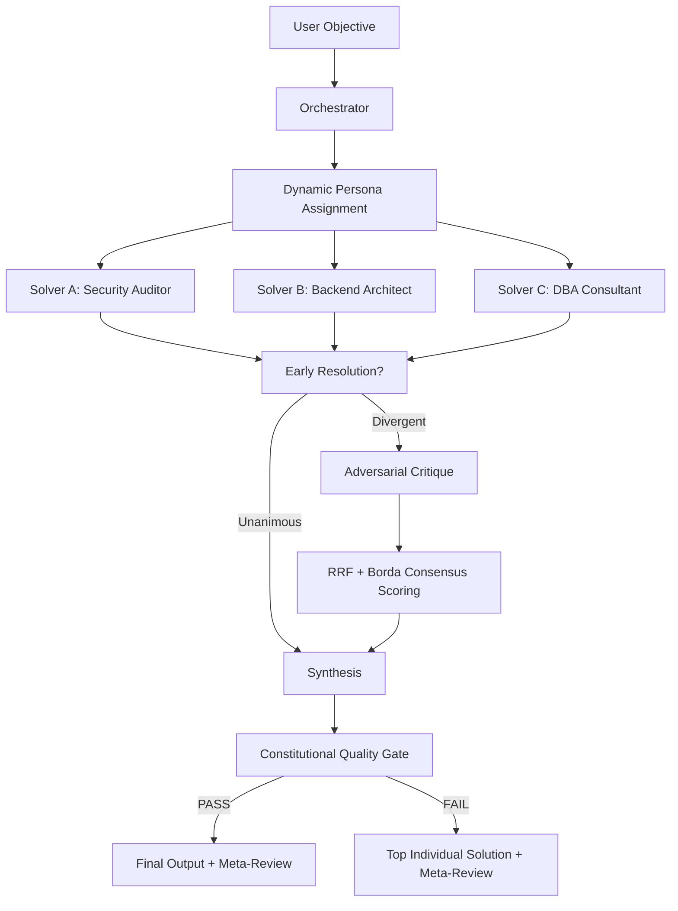

# LatticeAG PolyGnosis 🧠

<p align="center">
  <a href="https://github.com/mosesman831/PolyGnosis/blob/main/LICENSE">
    
  </a>
  <a href="https://www.python.org/">
    
  </a>
  <a href="https://github.com/mosesman831/PolyGnosis/stargazers">
    
  </a>
  <a href="https://github.com/mosesman831/PolyGnosis/issues">
    
  </a>
  <a href="https://github.com/mosesman831/PolyGnosis">
    
  </a>
  <a href='https://github.com/MShawon/github-clone-count-badge'></a>
  <a href='https://github.com/MShawon/github-clone-count-badge'></a>
</p>

<p align="center">
  <b>Adversarial multi-model consensus protocol for Hermes Agent.</b><br/>
  Independent solve. Adversarial critique. Formal scoring. Verified synthesis.
</p>

<p align="center">
  <a href="#quick-start">Quick Start</a> ·
  <a href="#why-polygnosis">Why PolyGnosis</a> ·
  <a href="#how-it-works">How It Works</a> ·
  <a href="#features">Features</a> ·
  <a href="#configuration">Configuration</a> ·
  <a href="#architecture-spec">Architecture Spec</a>
</p>

---

PolyGnosis eliminates single-model hallucination risk by routing complex
problems through a formal adversarial consensus protocol. Three or more
frontier models solve independently from dynamically assigned expert
personas. A hostile critic cross-reviews every solution. Formal ranking
algorithms - Reciprocal Rank Fusion and Borda Count - produce mathematically
sound consensus. A Constitutional Quality Gate prevents synthesis regressions.
The result: enterprise-grade output that no single model could produce alone.

Built from the PolyBrain orchestration pattern.

## Why PolyGnosis

- **Designed for mission-critical work** - when a hallucination costs real money, reputation, or safety.
- **Adversarial by design** - a dedicated critic model hunts bugs, edge cases, security flaws, and hallucinations in every solution.
- **Mathematically sound consensus** - deterministic RRF and Borda Count ranking on top of LLM per-axis scoring. No single opinionated model dominates the outcome.
- **Dynamic specialization** - the orchestrator assigns domain-appropriate expert personas (Security Auditor, DBA Consultant, Backend Architect) with matching tool restrictions.
- **Self-improving** - severe bugs are persisted to a Reflexion corrections buffer and injected into future solver prompts.
- **Cost-aware** - the Early Resolution circuit detects unanimous consensus and bypasses expensive critique + scoring phases.

### How PolyGnosis is different

- **Multi-model adversarial, not just multi-agent** - three genuinely different model architectures solve the same problem independently, then critique each other. Unlike naive multi-agent systems, PolyGnosis enforces *model diversity* across families, not just prompt diversity.
- **Formal scoring, not opinion** - RRF and Borda Count are deterministic algorithms borrowed from information retrieval. The LLM provides per-axis scores (0-10) but the ranking algorithm decides the winner.
- **Constitutional Quality Gate** - after synthesis, the output is compared against the best individual solution. If the synthesis regressed, it's rejected.
- **Asymmetric tool allocation** - personas that should read get `web, file`. Personas that should build get `terminal, file, web`. True specialization at the tool level via `hermes chat -t`.

## Quick Start

```bash
# 1. Clone and install
git clone --depth=1 https://github.com/mosesman831/PolyGnosis.git /tmp/polygnosis
rm -rf /tmp/polygnosis/.git
cp -r /tmp/polygnosis ~/.hermes/skills/research/polygnosis
rm -rf /tmp/polygnosis

# 2. Edit config.yaml with your model aliases
#    (orchestrator, solver_1/2/3, critic, synthesizer, meta_reviewer, fallback)
hermes config edit  # then edit ~/.hermes/skills/research/polygnosis/config.yaml

# 3. Validate config
python ~/.hermes/skills/research/polygnosis/scripts/validate_config.py

# 4. Use it - just tell Hermes what you want in a chat:
"Use PolyGnosis to design a production-grade JWT auth middleware in Rust"
# Hermes will load the skill and run the consensus protocol for you.
```

For advanced/manual use, you can also run the script directly:

```bash
echo "Build a production-grade database connection pool in Go with connection
health checks and graceful draining" | \
  python ~/.hermes/skills/research/polygnosis/scripts/boardroom_pipeline.py
```

## How It Works



## Features

### Core Protocol

| Feature | Description |
|---------|------------|
| **Parallel Solve** | 3+ distinct model families solve independently from specialized personas - all at once via ThreadPoolExecutor. |
| **Adversarial Critique** | A dedicated critic model aggressively hunts bugs, hallucinations, edge cases, security flaws, and architecture issues in every solution. |
| **Formal Consensus Scoring** | LLM produces per-axis scores (0-10 across 5 dimensions). RRF + Borda Count determine the ranking deterministically. |
| **Synthesis** | A synthesizer model extracts the strongest elements from all solutions into one unified output. |
| **Constitutional Quality Gate** | Post-synthesis regression check. If synthesis is worse than the best individual solution, the individual solution wins. |
| **Meta-Review** | Explains why the consensus verdict was reached, which flaws were rejected, and remaining risks. |

### Advanced Capabilities

| Feature | Description |
|---------|------------|
| **Dynamic Personas** | Orchestrator generates domain-specific expert roles from the problem statement - not generic labels. |
| **Asymmetric Tool Allocation** | Persona determines tool access: `Security Auditor` -> read-only (`web, file`), `Developer` -> write-capable (`terminal, file, web`). Enforced via `hermes chat -t`. |
| **Reflexion Corrections Buffer** | CRITICAL/HIGH severity bugs and hallucinations are persisted to `.corrections_buffer.json` and injected into future solver prompts. |
| **Early Resolution Circuit** | If all solvers reach unanimous consensus, critique + scoring phases are bypassed - massive cost and latency savings. |
| **Graceful Degradation** | Solver timeouts or failures don't crash the pipeline. Minimum quorum threshold ensures enough models remain for meaningful consensus. |
| **Debate Rounds** | Configurable critique -> revise loop. Default: 2 rounds. |

### Scoring Dimensions

| Axis | 0-10 | What it measures |
|------|------|-----------------|
| Correctness | Does it actually solve the problem? | Logic, spec compliance, edge cases |
| Efficiency | Optimal resource usage | Algorithmic complexity, allocations, I/O |
| Maintainability | Can a human understand and extend this? | Code clarity, abstractions, documentation |
| Robustness | Does it survive the real world? | Error handling, input validation, resilience |
| Security | Is it safe to deploy? | Vulnerabilities, secure defaults, defense in depth |

## Phases

```
Phase 0: Orchestrate        -> Problem statement + success criteria + dynamic personas
Phase 1: Parallel Solve     -> 3+ models solve from persona-driven prompts
Phase 1.5: Early Resolution -> Judge checks for unanimous consensus (bypass if yes)
Phase 2: Adversarial Critique -> Per-solution bug hunt + Reflexion buffer
Phase 3: Consensus Scoring  -> LLM per-axis scores -> RRF + Borda ranking
Phase 4: Synthesis          -> Unified enterprise-grade solution
Phase 5: Quality Gate       -> Compare synthesis vs best individual solution
Phase 6: Meta-Review        -> Explain the consensus decision
```

## Example

Tell Hermes:

```
Use PolyGnosis to design a production-grade JWT authentication middleware in Rust
with refresh token rotation, rate limiting, and revocation.
```

Or run directly:

```bash
echo "Design a production-grade JWT authentication middleware in Rust with
refresh token rotation, rate limiting, and revocation" | \
  python ~/.hermes/skills/research/polygnosis/scripts/boardroom_pipeline.py
```

### What you get

- A structured problem statement with success criteria
- Three independent solutions from specialized personas (Security Auditor, Backend Architect, Systems Designer)
- Adversarial critique reports for each solution (bugs, hallucinations, edge cases)
- Formal RRF + Borda consensus ranking
- A unified, battle-tested final solution
- Quality gate verdict (PASS/FAIL) with regression analysis
- Meta-review explaining the consensus decision

## Configuration

Edit `config.yaml`:

```yaml
models:
  orchestrator: ""        # Builds problem statement + personas
  solver_1: ""            # Must be a different model family
  solver_2: ""            # Different architecture
  solver_3: ""            # Different reasoning style
  critic: ""              # Strong adversarial reviewer
  synthesizer: ""         # Builds final output
  meta_reviewer: ""       # Explains consensus
  fallback: ""            # Fast fallback

settings:
  solver_count: 3
  scoring_algorithm: "hybrid"     # rrf | borda | hybrid
  rrf_k: 60                       # RRF constant
  quality_gate_enabled: true      # Reject regressed synthesis
  early_resolution_enabled: true  # Bypass critique on unanimous consensus
  max_debate_rounds: 2            # Critique -> revise iterations
  min_solvers_for_quorum: 2       # Minimum solvers before abort
```

See [`config.yaml`](config.yaml) for all options.

## Architecture Spec

For a comprehensive technical specification of every algorithm, phase, and protocol
in PolyGnosis, see [`POLYGNOSIS_SPEC.md`](POLYGNOSIS_SPEC.md). This document covers:

- The complete lifecycle with formal phase definitions
- Reciprocal Rank Fusion and Borda Count: mathematical derivations
- Persona-to-toolset classification taxonomy
- Early Resolution: quorum voting algorithm
- Reflexion buffer: persistence, deduplication, and injection mechanics
- Constitutional Quality Gate: regression detection protocol
- Graceful degradation and fault tolerance thresholds
- All prompt templates with rationales

## File Tree

```text
polygnosis/
├── SKILL.md                          # Skill definition (Hermes)
├── README.md                         # This file
├── POLYGNOSIS_SPEC.md               # Formal architecture specification
├── config.yaml                       # Model and settings configuration
├── scripts/
│   ├── boardroom_pipeline.py         # Full consensus protocol (~1200 lines)
│   └── validate_config.py            # Config validator
├── LICENSE                           # GPL-3.0
└── .corrections_buffer.json          # Reflexion buffer (created at runtime)
```

## Known Issues

- **Model-specific subprocess hangs** - Some models (e.g. `gpt-5-mini` via certain providers) can hang in `hermes chat` subagent calls. If a model hangs for 600s+, try a different model or provider. Test with `hermes chat -q "ping" -m your-model` first.
- **Critic JSON parsing** - If the critic returns non-JSON prose, it's wrapped with a default `PASS_WITH_ISSUES` score of 50. The pipeline continues - this is a graceful degradation path, not a failure.
- **RRF + Borda tie-breaking** - When two solutions are genuinely equal across all axes, both get rank 1. The synthesizer is then free to draw from both. This is by design, not a bug.

## Built From

PolyGnosis was built from the orchestration pattern pioneered by [PolyBrain](https://github.com/mosesman831/PolyBrain) - `config.yaml`-driven model routing, `hermes chat` subprocess execution, and `ThreadPoolExecutor` parallelism. PolyGnosis extends this foundation with adversarial consensus, formal scoring, quality gates, and Reflexion-based self-improvement.

## License

GNU General Public License version 3
